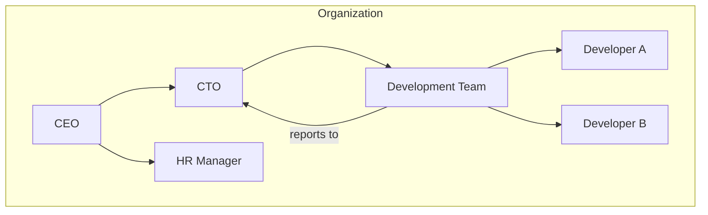
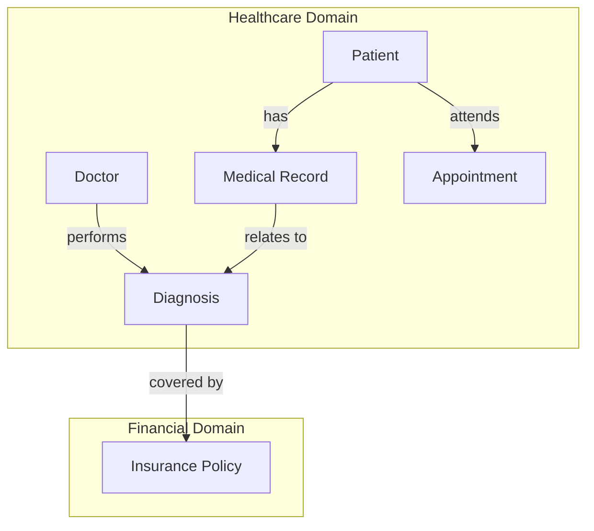

Here’s a set of Mermaid diagrams that illustrate both hierarchical and cross-domain relationships for Active Graphs. Each diagram provides a unique perspective on how data can be structured to manage complex, inter-domain connections dynamically.

---

### Hierarchical Structure Diagram

This first diagram demonstrates a hierarchical structure, such as an organizational hierarchy. Here, **nodes** represent departments and individuals, and relationships like **reports to** or **manages** capture hierarchy.

---

### Cross-Domain Structure Diagram

This diagram shows a **multi-domain structure**, such as a healthcare system where *Patient* and *Doctor* nodes in the **Healthcare Domain** are linked to *Policy* in the **Financial Domain**. This showcases how relationships cross domains and enable inferencing across them.

In this structure:
- **Hierarchical connections**: Within each domain (e.g., *Healthcare Domain*), nodes are connected by relationships relevant to their context.
- **Cross-domain links**: Relationships like **covered by** connect nodes from different domains, bridging *Diagnosis* in the *Healthcare Domain* to *Policy* in the *Financial Domain*.

---

These diagrams emphasize how Active Graphs seamlessly handle both hierarchical and cross-domain relationships, enabling rich data interaction and inference capabilities across complex datasets. Let me know if you need further adjustments or additional connections!
