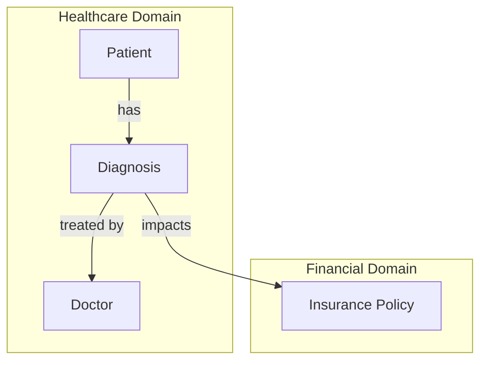

### Context and Knowledge Inference

In Active Graphs, context inference is built into the structure, enabling each node to recognize and understand its relationships, no matter how deep the hierarchy or how many domains it spans. This inherent capability transforms nodes from isolated data points into entities aware of their context and capable of deriving insights from it.

#### How Context Inference Works

Traditional databases often require predefined queries and specific joins to extract relational insights. In Active Graphs, however, relationships are defined at the structural level, with each node’s connections explicitly outlined. Relationships like **inherits from**, **contains**, and **relates to** allow the system to automatically traverse connections and infer context as new data points are added.

For instance, in a healthcare scenario, a **Diagnosis** node related to a **Patient** and **Doctor** node doesn’t just exist in isolation. Through context inference, Active Graphs can understand that the **Diagnosis** connects both the **Patient’s** health record and the **Doctor’s** treatment history, allowing the system to infer that this treatment history impacts the patient’s overall health journey.

#### Advantages of Context Awareness

By using context inference, Active Graphs can:
- **Identify Meaningful Patterns**: With direct awareness of its relationships, a **Diagnosis** node can be associated with treatment success rates, previous diagnoses, and policy implications without explicitly searching each layer.
- **Traverse Across Domains Seamlessly**: Relationships that span multiple domains, such as a **Patient**’s **Diagnosis** in the healthcare domain connecting to an **Insurance Policy** in the financial domain, allow the system to draw conclusions about coverage without separate querying.
- **Generate Actionable Insights**: Active Graphs’ contextual awareness can flag anomalies or suggest actions based on an entity’s full relational context. For example, if a patient’s records indicate a series of related diagnoses, it might suggest an underlying condition that warrants further investigation.

#### Knowledge Inference in Action

Imagine a **Trading Bot** that operates on minute-level stock data. Each **Minute Node** can relate to higher-level nodes like **Daily**, **Weekly**, and **Monthly Trends**, inferring context at multiple granularities. When new minute data enters the graph, it’s automatically connected to relevant **Volatility** and **Trend** nodes. This setup doesn’t just record isolated stock movements—it allows each node to infer how its patterns align with larger market movements, identifying opportunities or risks dynamically.

In practice, knowledge inference within Active Graphs means:
1. **Granular, Real-Time Data Integration**: Each new data point (minute or diagnosis) is added as a node that automatically links to its related context nodes.
2. **Flexible Relationship Structures**: Each relationship, defined explicitly, allows for context inference across both immediate and overarching hierarchies.
3. **Dynamic, Adaptive Learning**: Relationships can evolve, allowing the system to adapt its inferences and knowledge as the dataset expands.

Here’s a **Mermaid Diagram** showcasing the knowledge inference in a multi-level healthcare scenario, with patients, diagnoses, doctors, and policies interconnected across hierarchical and cross-domain structures:

In this diagram:
- **Diagnosis** nodes, connected to **Patient** and **Doctor** nodes, inherently infer that they are part of a health treatment journey.
- The **Diagnosis** impacts insurance **Policy** within the **Financial Domain**, showcasing how knowledge is inferred seamlessly across domains.

Active Graphs not only structure data but provide the logical framework for understanding and drawing insights from each piece of information as part of a greater whole. This ability to infer context and establish knowledge paths autonomously is a defining capability that makes Active Graphs more than a storage system—it’s a dynamic, adaptive knowledge engine.
