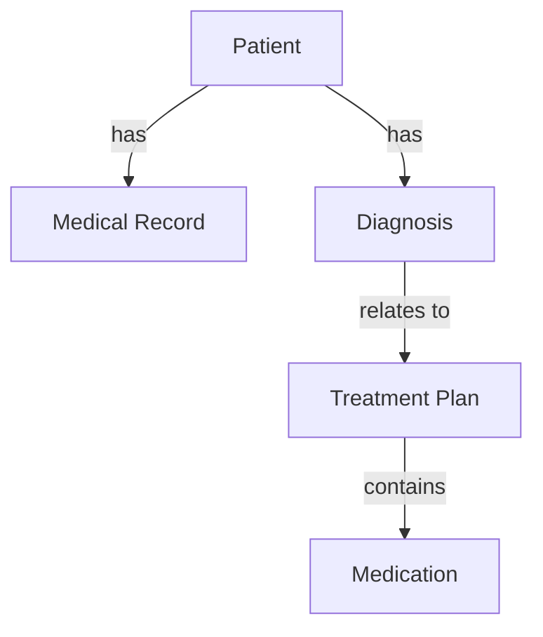
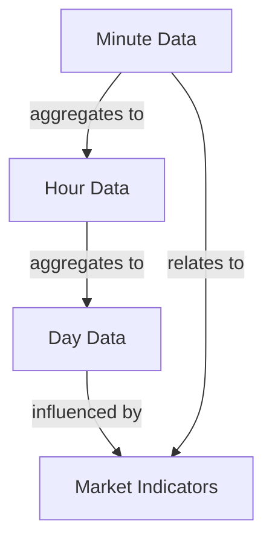
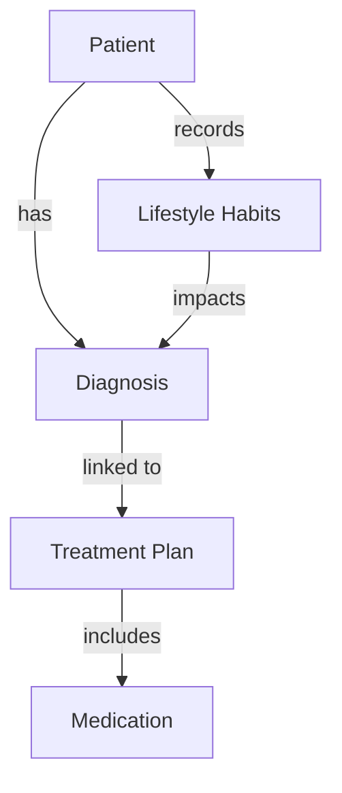
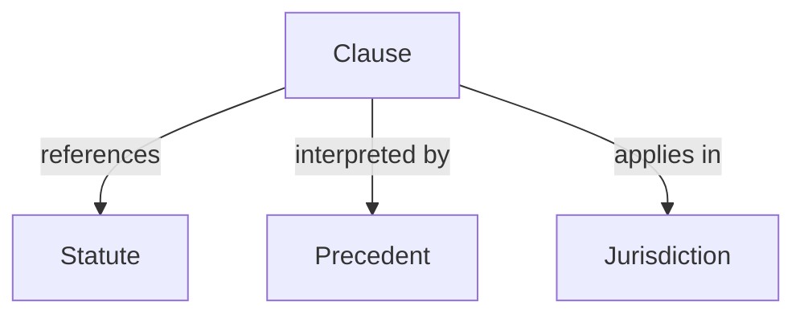
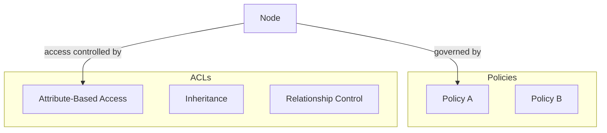
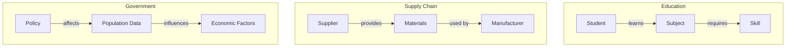

**Active Graphs: Revolutionizing Data Understanding Through Dynamic Relationships**

---

### Introduction to Active Graphs

Active Graphs represent a paradigm shift in data management by actively inferring relationships and context, mimicking real-world interactions. Unlike traditional databases with rigid schemas and complex queries, Active Graphs structure data as interconnected nodes and predefined relationships. This approach creates an intelligent, self-organizing system where data points understand their context within broader ecosystems, enabling applications that demand complex understanding across multiple domains.

### Credibility and Background

With over 15 years as an enterprise solution architect across healthcare, finance, and defense sectors, I've firsthand experience with the limitations of traditional data systems when handling complex, interconnected data structures. This multifaceted background inspired the development of Active Graphs, rethinking traditional data models to address modern challenges requiring adaptive learning and policy-driven insights.

### Key Projects that Shaped Active Graphs

1. **AI-Powered Trading Bot**: Developed an AI-driven trading bot leveraging interconnected market indicators, highlighting the need for data structured as interconnected nodes rather than isolated data points.

2. **YouMatter (Healthcare)**: Created a platform that streamlined patient data management, emphasizing the importance of capturing nuanced, hierarchical healthcare data in a dynamic, accessible format.

3. **OpenEYE (Legal Analysis)**: Built a legal analysis platform using Active Graph Networks to infer relationships between legal clauses, precedents, and statutory laws, demonstrating versatility across non-numerical domains.

These projects revealed a common need across domains: a data structure that intuitively maps relationships and infers context, leading to the conception of Active Graphs.

---

### Problem Statement

Modern data systems require flexibility and contextual awareness that traditional relational databases can't provide, especially when handling dynamic, interconnected datasets where context and relationships evolve continuously. Active Graphs address these limitations by:

- Supporting real-time updates for continuous learning.
- Enabling cross-domain interoperability and reasoning.
- Inferring implicit relationships without computational overhead.
- Self-organizing data structures for dynamic schema evolution.
- Integrating policy-driven decision-making with embedded security.
- Managing hierarchical and recursive data structures efficiently.
- Supporting NLP integration for context-aware relationships.

---

### The Concept of Active Graphs

#### What are Active Graphs?

Active Graphs are an innovative approach to data management where data is organized as nodes and predefined relationships. Each node functions like a mini-table representing an individual entity with relevant attributes, while relationships are predefined, rule-based links specifying how nodes interact. This setup provides clarity and immediate context, enabling meaningful insights to be drawn directly from the data model without relying on complex queries or pattern recognition algorithms.

#### Core Components of Active Graphs

- **Nodes as Small Tables**: Represent individual entities with relevant attributes.
- **Relationships as Defined Connections**: Predefined links (e.g., *contains*, *inherits from*, *relates to*) specifying node interactions.
- **Dynamic Structure with Policies**: Nodes and relationships evolve in real time, governed by policies like access control lists (ACLs).
- **Built-In Contextual Awareness**: Structured links enable nodes to inherently understand their place within the data structure.

#### Mermaid Diagram Placeholder

*Diagram 1: Example of nodes and relationships in Active Graphs.*

---

### Context and Knowledge Inference

In Active Graphs, context inference is built into the structure, enabling each node to recognize and understand its relationships, no matter how deep the hierarchy or how many domains it spans. This inherent capability transforms nodes from isolated data points into entities aware of their context and capable of deriving insights from it.

#### How Context Inference Works

Relationships are defined at the structural level, allowing the system to automatically traverse connections and infer context as new data points are added. This organization dramatically reduces the complexity of querying and enables meaningful insights without relying on complex pattern recognition algorithms.

---

### Use Case Examples

#### Financial Trading Bot

**Problem**: Traditional trading systems struggle to capture and utilize the dynamic context surrounding financial data, often relying on brute-force techniques and historical data for training.

**Solution**: Active Graphs enable minute-level data to integrate seamlessly into a contextual framework, where each Minute Node automatically links to corresponding Day, Weekly, and Volatility nodes. This setup allows the system to immediately contextualize each new minute of data, drawing real-time inferences based on its surrounding context.

**Outcome**: Reduced dependency on historical data training and dynamic, up-to-the-minute decision-making based on context-driven insights.

#### Mermaid Diagram Placeholder

*Diagram 2: Structure of trading data across multiple contexts in Active Graphs.*

---

#### Healthcare Data Management

**Problem**: Managing healthcare data requires linking diverse data—diagnoses, treatments, demographics—in ways that create a full picture of patient health, which traditional systems struggle to provide.

**Solution**: Active Graphs dynamically link patient data, diagnoses, treatments, and lifestyle factors, enabling the system to "infer" connections and provide a comprehensive, connected view of a patient's health journey.

**Outcome**: Improved decision-making, informed recommendations, and enhanced patient outcomes through real-time context inference.

#### Mermaid Diagram Placeholder

*Diagram 3: Structure of healthcare data in Active Graphs.*

---

#### Legal Document Analysis

**Problem**: Legal data is complex, requiring extensive cross-referencing to understand relationships between statutes, precedents, and jurisdictions.

**Solution**: Active Graphs structure legal documents into interconnected nodes, where each clause connects directly to related statutes, precedents, and jurisdictional rules, creating a dynamic network of legal knowledge.

**Outcome**: A more comprehensive, queryable knowledge graph that empowers legal professionals to gain context and insights efficiently.

#### Mermaid Diagram Placeholder

*Diagram 4: Interconnected legal data in Active Graphs.*

---

### Defining Policies and ACLs in Active Graphs

Active Graphs utilize policies and ACLs not only for security but also as feature engineering tools. Policies define rules for node interactions, while ACLs provide granular control over data access and relationship formation, enabling a secure, dynamic network where relationships evolve based on context and permissions.

#### Mermaid Diagram Placeholder

*Diagram 5: Interaction of policies and ACLs within Active Graphs.*

---

### Continuous Learning and Data Flexibility

Active Graphs allow for real-time addition and updating of nodes, reflecting changes instantly across the network. This continuous mapping enables the system to adapt without the need for traditional retraining models, ensuring constant adaptability and real-time contextual awareness.

---

### Foundation for Artificial General Intelligence (AGI)

By enabling systems to understand and infer relationships across diverse and complex datasets, Active Graphs lay the groundwork for AGI. Their ability to structure data dynamically, infer context automatically, and transfer learning across domains mirrors human cognitive processes, positioning them as a foundational technology for AGI development.

---

### The Broader Vision

Active Graphs have the potential to revolutionize data management across industries like education, supply chain, and government by providing a platform for dynamic, relationship-driven data structures.

- **Education**: Personalizing learning journeys by linking subjects, skills, and progress milestones.
- **Supply Chain**: Optimizing inventory and logistics by mapping relationships between suppliers, manufacturers, and retailers.
- **Government**: Understanding interconnected relationships between policies, population data, and economic factors.

#### Mermaid Diagram Placeholder

*Diagram 6: Potential applications of Active Graphs across industries.*

---

### Conclusion

Active Graphs represent a profound shift in data management, transforming data systems into dynamic, context-aware networks. By structuring data through relationships and context, they enable deeper insights and actionable intelligence from interconnected data points. This new paradigm enhances decision-making and has the potential to address complex, multi-domain challenges, paving the way for innovations across various industries.

---

### Call to Action

We invite you to explore the potential of Active Graphs within your own field or area of interest. Consider how a dynamic, interconnected system could transform the way you approach information. We're seeking feedback, insights, and collaborators who share our vision of a relationship-first approach to data management. Connect with us to push the boundaries of what's possible in data systems, building a foundation that could support the development of AGI and other groundbreaking advancements.

Join us on this journey. Let's reimagine the future of data—one relationship at a time.

---

*Note: The mermaid diagrams are placeholders. Please replace each "Mermaid Diagram Placeholder" code block with the actual diagram when posting the article.*
