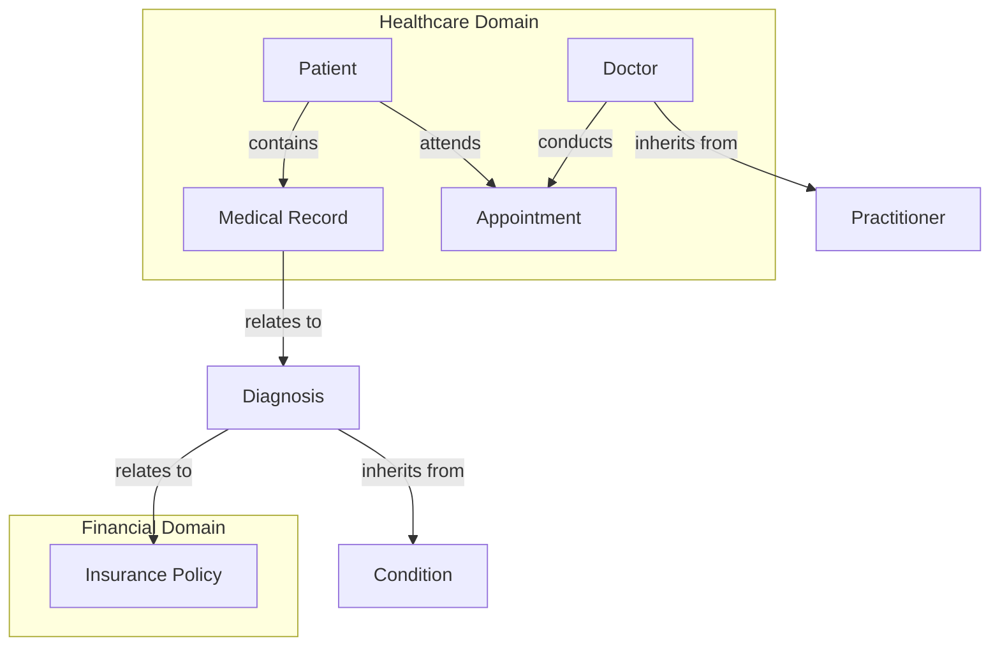

Here’s a Mermaid diagram that represents the basic structure of Active Graphs, showing nodes as small tables (entities like *Patient*, *Doctor*, and *Appointment*) and relationships (like **contains**, **inherits from**, and **relates to**) that create the foundational links among them.

In this structure:
- Each **node** (e.g., *Patient*, *Doctor*, *Medical Record*) functions like a mini-table with data attributes specific to that entity.
- **Relationships** illustrate predefined links, such as:
  - **contains** (e.g., *Patient* contains *Medical Record*)
  - **conducts** (e.g., *Doctor* conducts *Appointment*)
  - **relates to** (e.g., *Diagnosis* relates to *Policy*)
- **Inheritance** links are shown where one node inherits attributes or characteristics from another.

This diagram can be expanded to include specific policy-based relationships, ACLs, and other custom structures to suit the domain or application context. Would you like to refine any part of this diagram or add additional nodes?
