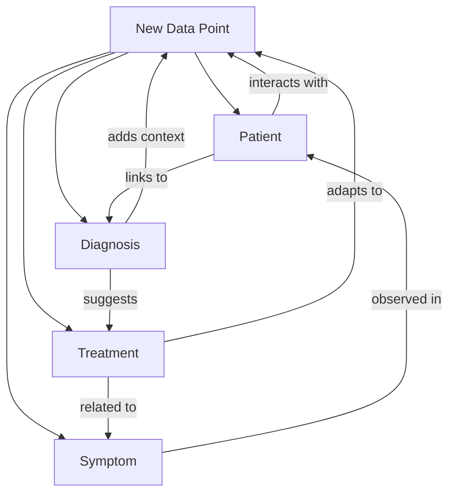

Here’s the fully formatted section with a placeholder for the mermaid diagram:

---

### Continuous Learning and Data Flexibility

Active Graphs introduce a breakthrough in data flexibility by allowing nodes to be added, updated, and interconnected in real-time, reflecting changes instantly across the entire network. Unlike traditional systems that require static schemas or pre-defined relationships, Active Graphs automatically incorporate new nodes into existing structures, dynamically adjusting connections and context based on predefined rules and policies.

#### Continuous Mapping and Adaptability

Each new node is mapped within the network based on its attributes and relevance to existing nodes. For example, in a healthcare setting, adding a new *Diagnosis* node with connections to specific *Symptoms* and *Treatment* nodes immediately informs the entire healthcare knowledge graph of this relationship. This adaptability resembles the behavior of neural networks, where each new data point adds layers of contextual understanding without needing to retrain the entire network.

#### Real-Time Contextual Awareness

Since Active Graphs allow data relationships to form dynamically, the platform achieves real-time contextual awareness. Imagine a trading bot that monitors minute-by-minute stock prices and volatility indicators. With each new minute, a node is added, instantly linking to other nodes such as daily volatility trends, economic indicators, or related news events. The trading bot doesn’t need a batch training session to ‘learn’ from this data; instead, it continuously adapts its understanding of market context as new nodes feed in.

#### Advantages Over Traditional Training Models

Traditional machine learning models rely on periodic retraining, where new data is periodically processed to update the model’s understanding. This approach is time-consuming and computationally expensive, especially as datasets grow. Active Graphs eliminate this need by inherently supporting continuous updates. Every time a new node is introduced, the relationships adjust in real-time, adapting instantly to changes. This means the system is always "learning," adjusting its understanding based on incoming data without needing intensive computational resources for model retraining.

---

**Mermaid Diagram Placeholder: Continuous Learning and Real-Time Mapping**

Here’s a mermaid diagram that represents how new nodes, such as *Patient*, *Diagnosis*, *Treatment*, and *Symptom*, are added and linked automatically within the network. This illustration emphasizes the dynamic adaptability and continuous mapping capabilities of Active Graphs.

---

In this section, we underscore the continuous, dynamic nature of Active Graphs, showcasing how the platform not only adapts to new data points but also establishes real-time contextual understanding, setting it apart from static databases and traditional machine learning models.

---

This version integrates your ideas into a cohesive, well-structured section. You can add the diagram directly by using the code block to generate the mermaid diagram as described. Let me know if any further tweaks are needed!
