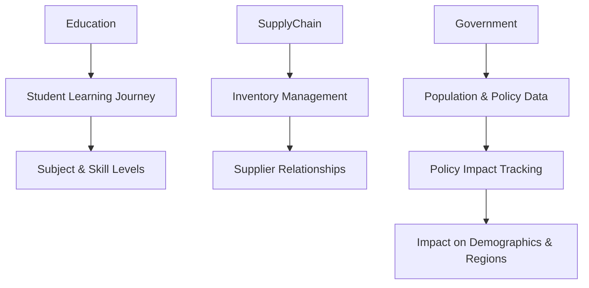

Here's a detailed section for **The Broader Vision and Future of Active Graphs**, covering the potential impact across industries, the concept of Active Graphs as a platform, and avenues for future research and development.

---

### The Broader Vision and Future of Active Graphs

#### Revolutionizing Data Management Across Industries

Active Graphs aren’t limited to healthcare, finance, or legal analysis—they represent a new paradigm in data management that can be applied to virtually any field where relationships and context matter. By redefining how data is stored, accessed, and interpreted, Active Graphs have the potential to transform industries that rely on complex, interdependent information.

In **Education**, for example, Active Graphs could manage and track a student’s learning journey in a highly personalized way. Each student’s knowledge graph could include nodes for subjects, skill levels, progress milestones, and relationships to instructors, peers, and extracurricular activities. The system could then infer insights into how a student's strengths in certain subjects may affect other areas, enabling educators to deliver tailored learning experiences.

In the **Supply Chain** domain, Active Graphs could help optimize inventory, production, and logistics by mapping the intricate relationships between suppliers, manufacturers, distributors, and retailers. Real-time updates on node relationships could instantly signal shifts in supply and demand, identify potential disruptions, and suggest alternative routes or suppliers, ultimately creating a more resilient and adaptable supply chain.

In **Government** and **Public Services**, the need to understand interconnected relationships between policy, population data, economic factors, and geographic regions is paramount. Active Graphs could streamline data-sharing and analysis across departments, enabling more effective decision-making based on a dynamic view of how policies impact various demographics and geographies over time.

These examples underscore that Active Graphs can serve as a backbone for any industry that relies on nuanced, context-rich data to make informed decisions.

---

#### Active Graphs as a Platform

The broader vision for Active Graphs extends beyond a single application; it’s a platform that others can leverage to redefine how they structure and interact with data. As a service or platform, Active Graphs could provide organizations the tools to build their own relationship-driven architectures, customized to fit their unique needs.

Consider **Active Graphs as a Platform** (AGaaP) for diverse fields:
- **Research and Academia**: Researchers could structure datasets across various domains, linking experiments, literature reviews, and prior findings in a cohesive, queryable graph. Cross-disciplinary insights could be inferred automatically, enabling more innovative research outcomes.
- **Business Intelligence**: Companies could design unique relationship structures between financial metrics, customer behaviors, and market trends. Active Graphs could dynamically adapt to new data, making it easier for businesses to spot emerging trends and make real-time decisions.
- **Human Resources**: With nodes representing employees, projects, skills, and training, organizations could use Active Graphs to identify skill gaps, optimize team structures, and even predict potential internal mobility pathways for employees, fostering career growth and retention.

As a platform, Active Graphs would provide users with:
1. **Customizable Node and Relationship Definitions**: Tailor node types and relationships to reflect the specific structures of each organization.
2. **Policy and ACL Integration**: Manage access and visibility with fine-grained control, ensuring compliance with data privacy and security requirements.
3. **Cross-Domain Compatibility**: Link nodes across disparate datasets and fields, facilitating a holistic approach to data management.

This vision transforms Active Graphs into a powerful, relationship-first tool that can be adapted across industries, fostering a new era of data fluidity and contextual intelligence.

---

#### Future Research and Development

The potential for Active Graphs is vast, and there are numerous areas to explore as the platform evolves:

1. **Scaling for Larger Datasets**: As the demand for contextual and dynamic data insights grows, Active Graphs will need to scale to accommodate larger and more complex datasets. This includes optimizing for performance and storage, enabling fast, efficient querying across millions of nodes and relationships.
  
2. **Machine Learning Integration**: While Active Graphs currently allow for context inference without traditional machine learning models, integrating machine learning could provide additional predictive capabilities. For instance, supervised or unsupervised learning could be applied to refine relationship strengths or suggest new, data-driven links between nodes. This fusion could open the door to a hybrid intelligence system where structured data and machine learning work in synergy.
  
3. **Enhanced Real-World Application Testing**: As Active Graphs gain traction, testing in more nuanced real-world environments will be essential. By implementing pilots in industries like healthcare, legal, and supply chain, Active Graphs can continuously adapt to meet practical needs, discovering new ways to optimize the system for diverse applications.
  
4. **Advanced Policy and Role-Based Features**: To support growing demands in data governance, further development around policy enforcement and role-based access control (RBAC) will be crucial. This includes creating even more granular control over node visibility, inheritance structures, and policy-driven data access. Such advancements would make Active Graphs an invaluable asset in industries with strict data privacy and compliance requirements, such as finance, healthcare, and government.

5. **User-Friendly Tools and Interfaces**: Expanding the Active Graphs platform with intuitive visualization tools, APIs, and customizable dashboards would make it accessible to a broader audience. This would enable data analysts, researchers, and industry experts to use Active Graphs without extensive technical knowledge, democratizing access to advanced, relationship-driven data structures.

6. **Exploring Cross-Domain Standardization**: With the potential to link data across various domains seamlessly, Active Graphs could explore standardizing certain node and relationship structures, facilitating interoperability between datasets from different industries. For instance, a “Person” node in healthcare could link to HR data, financial records, or legal profiles, unlocking insights at an unprecedented level of integration.

---

### The Future is Relationship-Driven

Active Graphs represent a new way of thinking about data—a shift from isolated tables and records to an interconnected, context-aware network that can adapt and evolve with new information. The potential to scale this model, integrate it with machine learning, and refine it for real-world applications opens the door to a future where **all** data is relationship-driven, and **context** is central to data management.

As Active Graphs continue to evolve, they may redefine data management across industries, paving the way for a more adaptable, intelligent, and holistic approach to understanding information. The possibilities are endless, and the journey has only just begun.

**Mermaid Diagram Placeholder for Industry Example Connections**  

This diagram illustrates how different industries—education, supply chain, and government—could use Active Graphs to structure and manage data through relationship-based insights, creating tailored solutions that address the unique needs of each domain.

---

In this section, the vision for Active Graphs is expanded, positioning it as a transformative approach to data management that empowers any industry to leverage dynamic, contextual insights. The potential as a platform, combined with future development goals, solidifies Active Graphs as a revolutionary tool with far-reaching impact.
