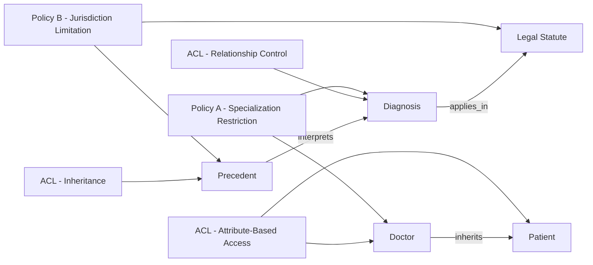

The diagram will work best in the **"Access Control Lists (ACLs) for Selective Access and Relationship Control"** subsection, right after explaining the key features of ACLs. This placement visually reinforces the concept of how ACLs and policies work together to manage relationships and security in Active Graphs.

Here’s the revised section with the diagram placement noted:

---

### Defining Policies and ACLs in Active Graphs

Active Graphs introduce a unique way to handle data security and relationship inference through policies and Access Control Lists (ACLs). These elements not only protect sensitive information but also serve as a mechanism to dynamically infer and control relationships across nodes. Unlike traditional systems where ACLs are strictly for permissions, in Active Graphs, they act as feature engineering tools that contribute to the system’s understanding and manipulation of data.

#### Policies as Feature Engineering Tools

In Active Graphs, policies extend beyond simple permissions. They define rules governing how nodes relate to each other, which relationships are valid, and how data flows within the network. By embedding these rules directly within the graph, Active Graphs can adjust the interactions between nodes dynamically based on the attributes of each node, thereby allowing for contextual understanding without additional processing layers.

For example:
- In a healthcare dataset, a policy might allow a *Doctor* node to view patient records, but only if the patient's condition matches certain criteria (e.g., relevant to the doctor’s specialization).
- In a legal context, a *Precedent* node may only be referenced by other cases within the same jurisdiction or type, ensuring that legal inferences respect geographic and case-specific boundaries.

These policies are intrinsic to Active Graphs, providing contextual restrictions that enhance the data’s interpretability without sacrificing security or adding manual complexity.

#### Access Control Lists (ACLs) for Selective Access and Relationship Control

ACLs in Active Graphs extend traditional permissions by introducing layered, attribute-based access. This enables the system to apply selective access to nodes and relationships based on user roles, data attributes, or even the structure of the graph itself. By using ACLs in this flexible manner, Active Graphs ensure that users can only access information relevant to their role or permissions, while allowing relationships to remain intact within the network for system-driven inferences.

**Key Features of ACLs in Active Graphs:**
1. **Attribute-Based Access**: ACLs can restrict access based on node attributes, such as a user’s role, department, or region. For example, only administrators might have permission to modify relationships in a financial network, while regular users can view but not alter connections.
2. **Inheritance**: ACLs can inherit properties from parent nodes, meaning that a node's access rules can cascade through the graph hierarchy. For instance, a *Manager* node might inherit permissions from a *Director* node, allowing for efficient management of access without duplicating ACLs across nodes.
3. **Dynamic Relationship Control**: ACLs enable specific relationships to be created or restricted based on conditions, facilitating adaptive networks that evolve based on context. For example, a *Patient* node can connect to a *Diagnosis* node only if the ACL permits it, based on the patient’s health history or the doctor’s specialization.

**Diagram Placeholder:**

### Adding Depth to Data Security and Usability

With policies and ACLs working in tandem, Active Graphs provide a framework that’s both secure and highly usable. Policies enable feature-rich data interactions that would otherwise require extensive custom code, while ACLs enforce security at a granular level. This dual approach not only prevents unauthorized access but also empowers the graph to self-manage and interpret its own relationships based on rules embedded directly within the network.

The combination of policies and ACLs ensures that Active Graphs remain flexible and secure, adaptable to various industries and use cases where data relationships are complex and security is paramount.

---

By placing the diagram here, readers will have a visual representation of how policies and ACLs interact with the nodes, reinforcing their understanding of these mechanisms within Active Graphs. Let me know if you'd like any further customization or additional visuals!
