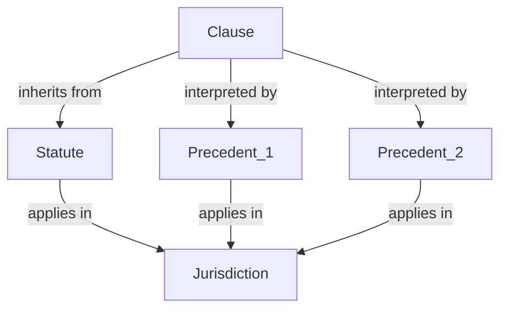
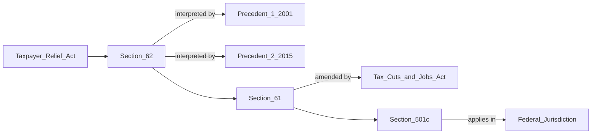
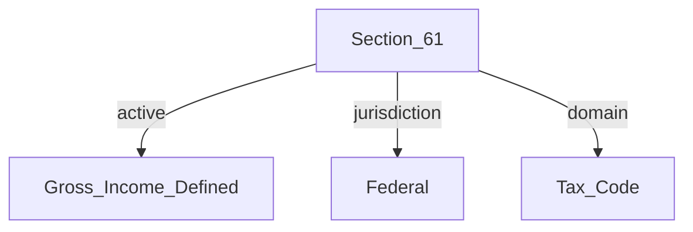

Here's the full *Legal Document Analysis* section with placeholders for the Mermaid diagrams where you can later replace with screenshots:

---

### Legal Document Analysis

#### Problem
Legal data is notoriously complex to structure due to its intricate web of statutes, precedents, interpretations, and jurisdictional contexts. In traditional data structures, each legal clause or statute is typically isolated, requiring extensive cross-referencing and manual analysis to understand its broader implications. For instance, understanding a single clause might involve interpreting its relationship to related statutes, historical cases, and jurisdiction-specific nuances. This creates a barrier for legal professionals, as they must sift through unstructured or loosely connected data to derive meaningful insights.

#### Solution
Active Graphs transform legal data management by structuring documents into sections that inherently understand their connections to relevant legal concepts. Each clause within a document can be represented as a node, linking directly to nodes representing related statutes, precedents, and jurisdictional rules. This creates a network where the relationships between laws, interpretations, and applications are not just stored but dynamically inferred.

> **Diagram Placeholder**: This diagram illustrates how a "Clause" node connects to various relevant entities, including statutes, precedents, and jurisdictions, showcasing relationships like "inherits from" and "interpreted by." The structure creates a dynamically connected web of legal knowledge, allowing professionals to infer contextual links without manually tracing each reference.

In Active Graphs, a single clause could connect to:
- **Statutes** that provide the legal basis or reference for the clause.
- **Case precedents** that have historically interpreted the clause, potentially in different jurisdictions.
- **Jurisdiction nodes** that specify where particular interpretations apply or differ.

These nodes, connected through relationships like "inherits from" and "interpreted by," provide a structured view of legal data. This enables automatic inference across domains, making it easy to trace how a legal clause is influenced by multiple cases, historical interpretations, and jurisdictional contexts.

> **Diagram Placeholder**: This diagram represents a broader legal network where sections are interconnected with acts, precedents, and jurisdictions. Here, each section relates to acts and precedents, showing the complexity and hierarchy that Active Graphs can efficiently structure.

#### Outcome
The result is a more comprehensive, queryable knowledge graph that empowers legal professionals to gain context and insights at unprecedented speeds. By following the relationships across nodes, legal professionals can see how a single clause has been applied, interpreted, or even amended over time and across different jurisdictions. This capability could transform legal research and case preparation, enabling faster decision-making based on a deep, interconnected understanding of the law.

> **Popup Interaction Placeholder**: This example demonstrates how interactive exploration within Active Graphs can reveal specific attributes of a legal section, such as its status, jurisdiction, and domain. Legal professionals can explore details without navigating through multiple documents.

---

This section provides a detailed explanation of the problem, solution, and outcome, with Mermaid diagram placeholders for visualization. Each placeholder represents a specific concept in the *Legal Document Analysis* workflow, showing the hierarchical and dynamic relationships within legal knowledge. You can replace these placeholders with your screenshots to give readers a comprehensive view of the Active Graphs approach. Let me know if any further adjustments are needed!
