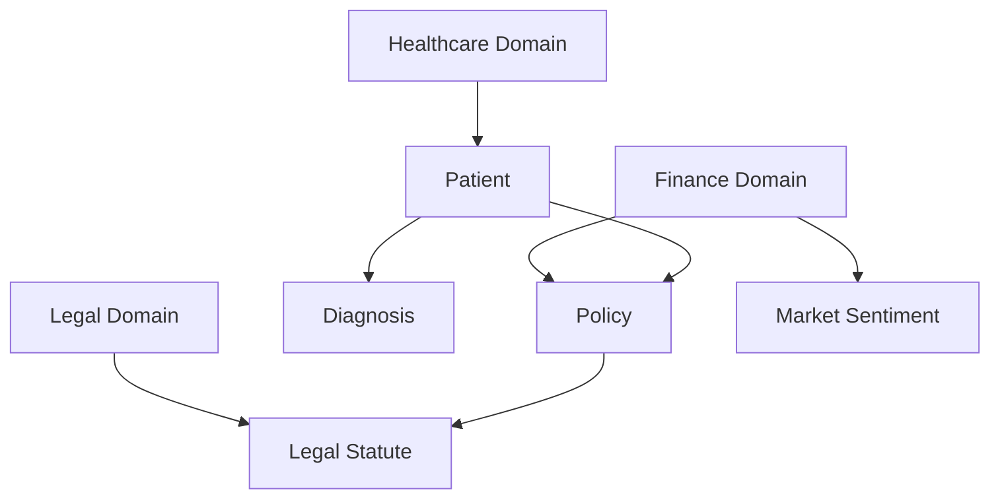

Here's a comprehensive section on **Structured Data as a Foundation for AGI**. This builds on the continuous adaptability of Active Graphs, suggesting that this structured approach is a stepping stone towards Artificial General Intelligence (AGI).

---

### Structured Data as a Foundation for AGI

Active Graphs not only redefine how we manage and interpret complex data relationships but also lay the groundwork for an even more ambitious goal: Artificial General Intelligence (AGI). By transforming structured data into a network of self-updating, context-aware nodes, Active Graphs enable systems to understand and infer relationships in a way that mimics human intelligence. This capability positions Active Graphs as a foundation for AGI, allowing them to handle diverse and complex datasets across any domain.

#### From Structured Data to General Intelligence

AGI requires an ability to recognize patterns, draw inferences, and adapt to new information across varied contexts. Traditional AI models rely on supervised training to learn relationships within narrow, predefined domains, often limited to a specific task. However, Active Graphs operate differently by structuring data into a constantly evolving network of interconnected nodes, allowing knowledge to transfer across domains dynamically.

For instance:
- **Healthcare:** Active Graphs can dynamically link a patient’s health metrics to diagnoses, treatment options, and even lifestyle factors. By recognizing patterns across patient data, it could suggest treatment changes in real time, reflecting an ability to understand context and make data-informed decisions similar to a clinician.
- **Finance:** By linking minute-level trading data to broader market indicators, Active Graphs enable real-time decision-making. This mirrors a trader's intuition, where decisions are based on an awareness of both current trends and historical patterns.
- **Legal Analysis:** Active Graphs can map the relationships between statutes, precedents, and interpretations, creating a knowledge graph where legal implications are dynamically inferred based on historical cases and jurisdictional nuances.

In each of these scenarios, Active Graphs move beyond storing data to *understanding* and *responding* to it, showcasing a foundational step toward AGI.

#### Why Structured Data is Key to AGI

The concept of AGI depends on a system's ability to process information similarly to the human brain, making connections between ideas, facts, and contexts without explicit instructions. Structured data, as implemented in Active Graphs, provides a reliable base for this by ensuring every piece of information is contextually linked within a broader network. This structure facilitates an ability to transfer learning from one domain to another, a hallmark of AGI.

For example, Active Graphs could use:
- **Hierarchical Relationships** to infer causality (e.g., "diagnosis leads to treatment, which results in a change in health metrics"),
- **Cross-Domain Relationships** to infer impact (e.g., "market sentiment affects minute-level trading trends"),
- **Policy-Based Constraints** to maintain ethical or regulatory considerations, such as those in healthcare and legal domains.

These structured relationships and dynamic adaptability allow Active Graphs to interpret new data within a context it "understands" from previous interactions, much like a human learning from past experiences.

#### How Active Graphs Enable Cross-Domain Reasoning

One of the most powerful features of Active Graphs is their ability to understand and infer connections across different domains. Unlike siloed machine learning models, which are constrained to a narrow field, Active Graphs can bridge information from healthcare to finance to legal data, providing a cohesive understanding that could form the basis for AGI. 

Imagine a scenario where:
- A healthcare AGI system understands that lifestyle factors affect diabetes management, and it automatically adapts a patient’s treatment plan based on exercise data or meal logs.
- A financial AGI bot learns that economic policy changes affect market trends, and it applies similar logic to analyze legal shifts, predicting financial impacts of new regulations.
  
In these cases, Active Graphs operate as a form of synthetic reasoning across domains, using structured data relationships to achieve insights that a single-domain AI could not.

#### A New Paradigm: Policies as Feature Engineering for AGI

Active Graphs leverage policies not just for security but as tools for feature engineering within AGI. Policies act as predefined rules that guide how nodes interact, offering a framework for AGI to interpret new information. These policies act as guardrails, ensuring that each node’s behavior aligns with broader system objectives, much like ethical or contextual awareness in human intelligence.

For instance:
- **In Healthcare:** Policies ensure that patient privacy is maintained while data is shared across nodes to enhance care.
- **In Finance:** Policies guide the bot in balancing risk and reward, maintaining a strategic focus.
- **In Legal Analysis:** Policies ensure respect for jurisdictional boundaries and interpretive precedents.

These policies make Active Graphs context-aware in ways that traditional models are not, aligning data relationships with human decision-making principles, which is critical for AGI.

#### A Path Forward: The Vision for AGI through Active Graphs

While Active Graphs are not yet AGI, they are a crucial stepping stone toward it. By creating an infrastructure that:
1. **Structures Data Dynamically:** Nodes continuously link and update in response to new information.
2. **Infers Context Automatically:** Relationships between data points are inferred rather than hard-coded, mirroring cognitive flexibility.
3. **Transfers Learning Across Domains:** Knowledge in one area (like finance) can inform decisions in another (like legal analysis), a hallmark of general intelligence.

Active Graphs represent a foundational shift in how we conceptualize data management and intelligence, from isolated datasets to an interconnected network of knowledge. The ultimate goal is a system capable of complex, nuanced understanding across any domain, not because it has been explicitly trained on every possible scenario, but because it understands how to infer meaning and context.

---

**Mermaid Diagram Placeholder for Cross-Domain Example**  

This diagram illustrates how Active Graphs facilitate cross-domain reasoning by linking nodes from healthcare, finance, and legal domains. This kind of structure could support AGI by enabling the system to interpret, infer, and transfer knowledge across these domains in real time, providing a holistic, adaptable foundation for general intelligence.

--- 

This section positions Active Graphs as a paradigm shift in data structuring and intelligence, emphasizing their potential to form the foundational layers of AGI through dynamic, contextually rich networks of data.
