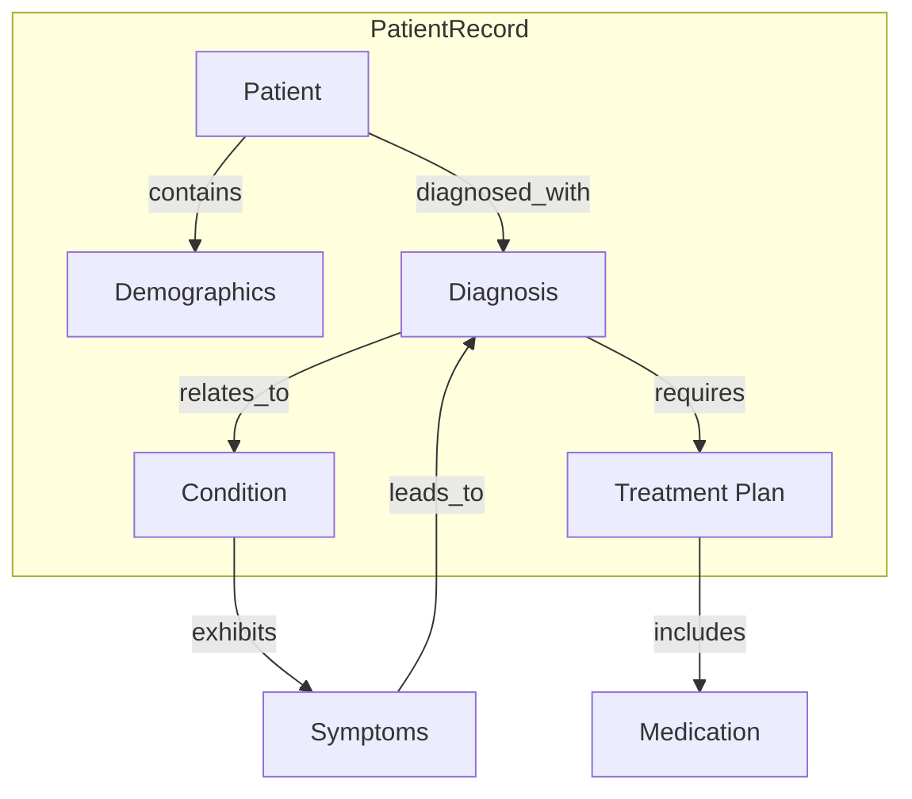

### Healthcare Data Management

**Problem**: Managing healthcare data demands more than just storing patient records and medical information. Healthcare systems must link diverse data—diagnoses, treatments, demographics, medications—in ways that create a full picture of patient health. However, traditional patient administration systems (PAS) are often limited to static records, lacking the flexibility to infer meaningful connections across medical domains. Consequently, this restricts healthcare providers from fully understanding the nuances of each patient’s condition and identifying relevant treatment options without extensive manual cross-referencing.

**Solution**: Active Graphs enables healthcare data to be stored and interconnected in a way that actively models these relationships. Imagine a **Patient Node** in Active Graphs, dynamically linked to various nodes representing **Diagnoses**, **Treatment Plans**, **Medications**, and **Symptoms**. Instead of isolated data points, each node understands its relationship to other nodes, allowing the system to “infer” connections. For example, a **Condition Node** may connect to **Symptom** and **Treatment Nodes**, providing an understanding of standard symptoms and recommended treatments that can inform healthcare decisions dynamically.

This setup transforms traditional static records into a multi-layered, contextual graph. A **Patient Node** linked to a **Diagnosis Node** not only reveals the diagnosis but also maps out associated symptoms, treatments, and even related conditions. This allows healthcare providers to quickly trace from a patient to all relevant medical details, making connections that would otherwise be buried in isolated records.

#### **How It Works:**

1. **Patient Node**: Central to the patient’s data, it contains demographic details and links to their medical records.
2. **Diagnosis Node**: Linked to the Patient Node, it provides diagnostic information and connects to related conditions or similar cases.
3. **Treatment Plan Node**: Contains details on treatments and is linked to the Diagnosis Node. The Treatment Plan Node can also connect to related Medications and Symptom Nodes.
4. **Condition Node**: Contains information on specific medical conditions, linked to standard symptoms, treatments, and potential medications.

For example, if a patient is diagnosed with **Hypertension**, the **Patient Node** connects to:
- **Hypertension Node** (Diagnosis)
- **Symptom Nodes** (e.g., Headache, Fatigue)
- **Treatment Plan Node** (e.g., Lifestyle changes, Blood pressure medications)

Each node understands its relationships, enabling the healthcare system to “infer” that patients with similar symptoms or diagnoses may benefit from related treatments, or alert providers to potential risks based on the patient’s demographic profile and connected medical history.

#### **Outcome**:
With Active Graphs, patient administration systems gain the capability to function as dynamic, intelligent systems:
- **Improved decision-making**: By having a clear structure of connections, healthcare providers can quickly determine treatment paths based on known relationships.
- **Informed recommendations**: With inferred context, PAS systems can make recommendations or flag potential risks based on interconnected data points.
- **Enhanced patient outcomes**: The comprehensive, connected view enables faster, more accurate decision-making and treatment planning, reducing the time required to assess patient needs.

This creates a healthcare system where relationships and context become active components of patient data, rather than static records.

---

#### **Diagram**:

Here’s a **Mermaid Diagram** showing how Active Graphs structures healthcare data:

In this diagram:
- **Patient** node is central, with relationships to **Demographics**, **Diagnosis**, **Treatment Plan**, and **Condition** nodes.
- **Diagnosis** connects to **Condition** and **Treatment Plan**, allowing the system to understand the broader medical context.
- **Condition** node links to **Symptoms**, which can link back to a **Diagnosis** node, enabling a dynamic structure where symptoms inform diagnoses and conditions infer potential treatments.

Through this graph structure, Active Graphs offers a foundation for healthcare systems that “understand” patient relationships in real time, empowering healthcare providers to make data-informed decisions quickly and efficiently. This real-time context inference represents a significant step toward intelligent healthcare data management, paving the way for enhanced patient care and optimized medical workflows.
