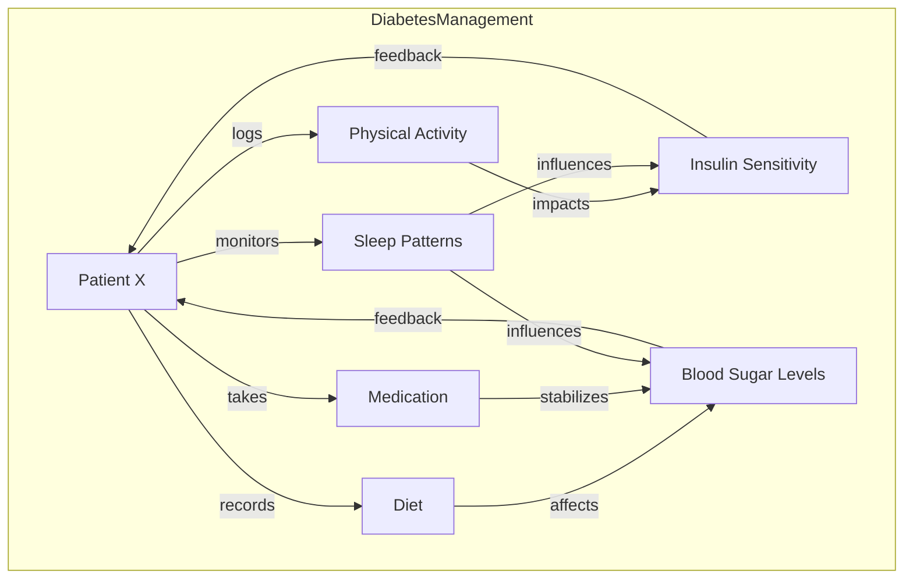

**Example: Mapping Lifestyle Habits to Diabetes Management**

Using Active Graphs, healthcare providers—or even individuals—can connect lifestyle habits to health conditions, such as diabetes, providing an insightful, data-driven view of how daily choices influence overall health. Imagine tracking the following lifestyle factors for a diabetes patient, **Patient X**, to understand the real-time impact on their condition:

- **Physical Activity**: Recorded exercise data, which connects to insulin sensitivity and glucose levels.
- **Diet**: Intake logs connecting to carbohydrate, sugar, and fat consumption, mapped to changes in blood sugar.
- **Medication**: Information on diabetes medication, linking adherence to its impact on glucose stability.
- **Sleep Patterns**: Daily sleep duration and quality, connected to metabolism and blood sugar fluctuations.

In this context, **Active Graphs** enables the system to create a relational network where each habit node (e.g., exercise, diet, sleep) is linked to diabetes management nodes (e.g., blood sugar levels, insulin sensitivity). This approach captures the complex, dynamic relationship between lifestyle factors and health outcomes.

### How It Works in Practice:

Using publicly available datasets, such as those on Kaggle, you can connect **Patient X’s** daily habits to changes in their glucose levels and insulin response:

1. **Physical Activity Node**: Tracks time, type, and intensity of exercise. This node links to **Glucose Stability**, as physical activity increases insulin sensitivity, which stabilizes blood sugar.
2. **Diet Node**: Links each meal’s nutritional breakdown to **Blood Sugar Variability**, capturing how carbohydrate intake directly impacts glucose.
3. **Medication Node**: Records timing and dosage of diabetes medication, connecting to both **Insulin Sensitivity** and **Blood Sugar Control**.
4. **Sleep Patterns Node**: Logs sleep quality and duration, linking these to **Metabolic Function**, which is vital for maintaining blood sugar balance.

### Benefits of this Setup:

- **Quantifiable Impact**: Active Graphs allows each lifestyle choice to have a quantifiable impact on glucose levels, enabling **Patient X** and their healthcare providers to see, in real-time, how each decision affects their condition.
- **Preventative Insights**: By analyzing patterns, the system can flag habits that frequently result in higher glucose variability, providing actionable recommendations on diet or activity adjustments to improve diabetes control.
- **Behavioral Adjustment**: With clear insights into how daily choices affect diabetes, **Patient X** has the tools to make informed, data-driven decisions that can improve their condition over time.

This setup would essentially provide a personalized **Health Management Graph** for **Patient X**, empowering them to understand how lifestyle modifications can directly improve their diabetes management.

---

#### **Diagram: Diabetes Management Graph**

Here’s a **Mermaid Diagram** illustrating how this setup might look in Active Graphs:

In this graph:
- **Patient X** is at the center, with nodes for **Physical Activity**, **Diet**, **Medication**, and **Sleep Patterns** feeding into their **Blood Sugar Levels** and **Insulin Sensitivity**.
- Each habit node links to outcomes, creating a relational map where **Patient X** and their healthcare team can immediately see the direct impact of lifestyle choices on diabetes management.

This **Diabetes Management Graph** example shows how Active Graphs could not only provide clarity in healthcare data but also enable patients to make better, more informed decisions that directly contribute to improved health outcomes. This model could extend to managing various chronic conditions, supporting a proactive approach to healthcare with real-time, actionable insights.
