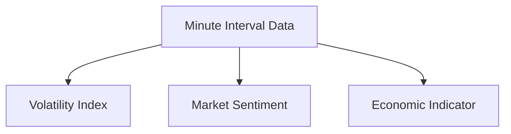

Certainly! Here’s an expanded section that includes both the **Patient Diagnosis Example** and the **Time Series Interval Data Example**, each with placeholders for mermaid diagrams that we can reference directly in the text.

---

### Continuous Learning and Data Flexibility

Active Graphs introduce a novel approach to data flexibility by allowing nodes to be added, updated, and interconnected dynamically, reflecting changes instantly across the entire network. Unlike traditional systems that require static schemas or pre-defined relationships, Active Graphs incorporate new nodes automatically, mapping them into existing structures and adjusting connections based on contextual relevance and predefined rules.

#### Continuous Mapping and Adaptability

Each new node is mapped within the network based on its attributes and relevance to existing nodes. For instance:

**Example 1: Patient Diagnosis in Healthcare**  
In a healthcare setup, a patient’s information can be continuously enriched by connecting new health metrics, diagnoses, and treatments as they become available. Suppose we have a patient node linked to nodes for diagnosis, treatment, and lifestyle factors. As new data—like blood sugar levels or exercise habits—is added, these nodes automatically link to the patient’s record, providing a continuously updated view of health status and potential interventions.

**Mermaid Diagram Placeholder**  

In this setup, relationships between nodes like **Lifestyle Factors** and **Diagnosis** allow the system to automatically infer health insights. For example, it could link rising blood sugar levels with an insufficient exercise routine, making recommendations based on real-time data.

**Example 2: Financial Trading Bot with Time Series Data**  
In a financial trading bot configuration, minute-by-minute interval data can be linked to broader indicators such as sentiment analysis, volatility indexes, or other relevant economic factors. As new data points come in, each minute interval node is dynamically linked to the relevant sentiment or volatility indicators, allowing the trading bot to leverage context-rich data in real-time decision-making.

**Mermaid Diagram Placeholder**  

This configuration enables each new minute data point to connect directly to context-providing nodes like **Volatility** or **Market Sentiment**, allowing the bot to make informed decisions based on the latest market conditions without needing brute-force training.

#### Real-Time Contextual Awareness

Since Active Graphs allow data relationships to form dynamically, the platform achieves real-time contextual awareness. In healthcare, this might mean a system that automatically adjusts a patient's treatment plan based on new lab results or lifestyle data. In finance, it means a trading bot that adapts instantly to changing market conditions, without needing retraining.

#### Advantages Over Traditional Training Models

Traditional machine learning models rely on periodic retraining, requiring data to be batch processed to update the model’s understanding. Active Graphs eliminate this need by inherently supporting continuous updates. Every new node introduced into the system is mapped in real-time, enabling constant adaptability without the computational overhead of regular model retraining.

---

These examples highlight the power of Active Graphs in adapting to changes in real-time across multiple domains. The **Patient Diagnosis Example** emphasizes adaptability in healthcare, while the **Time Series Interval Data Example** showcases its application in financial trading, offering a continuous, context-rich framework for decision-making.
